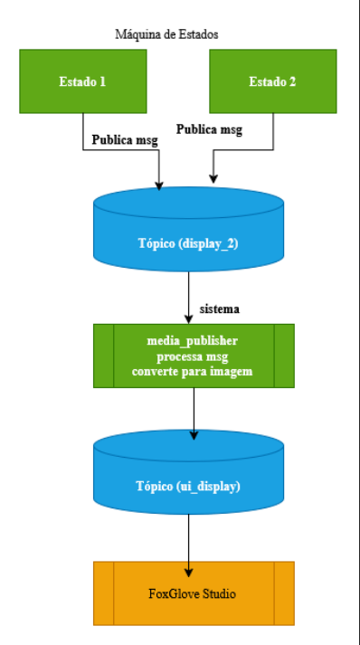

# 🖼️ Media Publisher ROS2 - Sistema de Exibição para Foxglove

**Nó intermediário que processa mensagens de texto, imagens, vídeos e tópicos ROS, convertendo-os para exibição no Foxglove Studio.**

## 📋 Visão Geral
Sistema que recebe mensagens do tópico `display_2`, processa conforme o tipo (`sentence`/`img`/`video`/`topic`) e publica imagens padronizadas no `ui_display` para visualização no Foxglove.



## 🚀 Funcionalidades
- **Conversão automática** de:
  - Texto → Imagem com fundo branco
  - Vídeos → Primeiro frame redimensionado
  - Imagens → Redimensionamento com aspect ratio
  - Tópicos ROS → Repasse direto de imagens
- **Integração nativa** com Foxglove Studio via rosbridge
- **Parâmetros configuráveis** (tamanho da tela, cores)

## 🛠️ Estrutura do Código
pub_test/
├── launch/
│ └── media_publisher.launch.py # Configura ROSBridge + nó
├── msg/
│ └── DisplayMessage.msg # Define type/value
├── src/
│ └── publicador_midia.py # Lógica principal
├── package.xml # Dependências
└── setup.py # Configuração Python

## 📦 Dependências
- ROS2 Humble (ou versão compatível)
- Pacotes:
  ```bash
  sudo apt install ros-$ROS_DISTRO-cv-bridge ros-$ROS_DISTRO-rosbridge-suite

## 🖥️ Como Executar
Compile o pacote:
cd ~/ros2_ws
colcon build --packages-select pub_test --symlink-install
source install/setup.bash
Inicie o sistema:
ros2 launch pub_test media_publisher.launch.py
→ Automaticamente abre o Foxglove no navegador.

## 🧩 Tipos de Mensagens
Tipo	Exemplo de Value	Ação
sentence	"Texto livre"	Converte para imagem de texto
img	"/path/da/imagem.jpg"	Exibe imagem estática
video	"/path/do/video.mp4"	Mostra primeiro frame
topic	"/camera/image_raw"	Repassa imagens do tópico

## 🐛 Solução de Problemas
"Unknown package 'pub_test'":

rm -rf build install log
colcon build --packages-select pub_test
source install/setup.bash

📄 Licença

Apache License 2.0

✉ Contato: Miriã Evangelista - evangelista@furg.br 